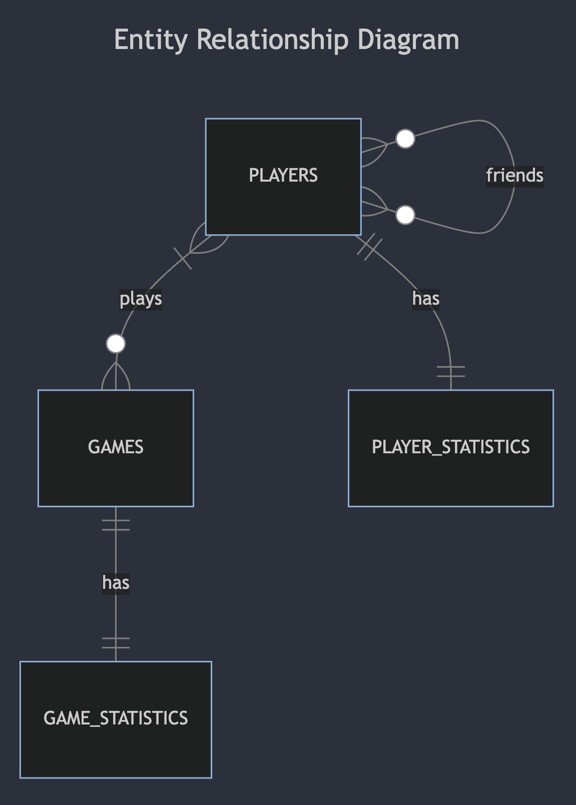

# Design Document

By Sanyam Shah


## Scope


* Purpose of this Database

The purpose of this project is to design a database for a fictional chess website. Chess has been on a boom since the last two years. The websites were originally not being able to handle the sudden rise of players registering on their websites, and were therefore crashing. I wanted to create a database that stores basic information that a chess website requires, and make it highly optimized. I am a huge chess fan and this was a way for me to learn about how chess websites store information.

* The people, places, things, etc. included in the scope of your database

The chess players, their games, information about their friendship, player statistics, game statistics, summary game statistics and world rankings is the scope of this database.

* The people, places, things, etc. *outside* the scope of your database

Information about chess puzzle ratings for players, the chess courses they completed, time control for games are some of the things that are outside of the scope of this database.

## Functional Information

* What can a user do with this database?

The user should be able to create a new account, view their game statistics, view their own personal statistics over multiple games,view the top 5 players in the world, view other players' profile.

* What's beyond the scope of what a user can do with this database?

The user cannot directly manipulate the databse. They cannot change their amount of wins, or draws, or losses.

## Representation

### Entities

* Which entities are represented in this database?
Players, games, friendships, individual player statistics, and individual game statistics are the entities that I chose to represent in this database.

* What attributes do those entities have?

Players:
id: Unique identifier for each player.
username: Unique username for each player.
password: Password for an account.
rating: The rating of that player

Games:
id: Unique identifier for each game.
player_1: Foreign key referencing the ID of player 1.
player_2: Foreign key referencing the ID of player 2.
color_player_1: Color assigned to player 1 (e.g., 'white' or 'black').
won: Foreign key referencing the ID of the winning player.

Friendships:

id: Unique identifier for each friendship.
player_1: Foreign key referencing the ID of the first player.
player_2: Foreign key referencing the ID of the second player.
start_date: The date when the friendship started.
end_date: The date when the friendship ended (if applicable).

Player Statistics:

player_id: Foreign key referencing the ID of the player.
wins: Number of wins achieved by the player.
draws: Number of draws achieved by the player.
losses: Number of losses suffered by the player.
average_accuracy: Average accuracy of the player's moves.

Game Statistics:

game_id: Foreign key referencing the ID of the game.
accuracy_player_1: Accuracy of moves made by player 1 in the game.
accuracy_player_2: Accuracy of moves made by player 2 in the game.


* Reason for choosing the types

I chose the types based on the values of the attributes. I also took inspiration from other chess websites like ```chess.com``` and ```lichess.org```.

* Reason for choosing the constraints

I chose the constraints for all the entities based on data from websites. For example, usernames are unique in websites like ```chess.com``` and ```lichess.org```, so I chose my username attribute to be unique. For each attribute, I thought about the different values that it could have, and based on that I chose particular constraints for it.


### Relationships



## Optimizations


* Which optimizations (e.g., indexes, views) are created? Why?

I created a view called ```world_ranking``` which will display some information about the players ordered by rating. I created this because knowing who is at the top is useful information.

I created a view called ```summary_game_statistics```. This view is useful to just get a brief summary of a game.

I created a view called ```friendship_duration```. This is useful because it provides information about who has friended who, and how long has their friendship lasted.

There is another view called ```game_results```. This view is useful because it provides basic information about a particular game, like who played the game and who won.

For indexes,

I created an index called ```username_index```. This index is especially helpful for queries that look up information based on specific usernames. These queries also occur very frequently.

I created another index called ```game_id_index```. This index is useful to look up something based on the game id. This also happens frequently when getting information about game statistics.

I created another index called ```player1_player2_index```. This will be useful in cases where someone is querying information based on specific ids for player_1 and player_2.

I created another index called ```player_id_index```. This index is on the ```player_statistics``` table. This will make it faster to get information about a players statistics.

I created another index called ```game_statistics_id_index```. This index is on the ```game_statistics``` table, which will make getting information about game statistics way faster.

There is another index called ```player_game_index```. This index is useful to when someone wants to look up information using the player_id and the game_id.

## Limitations


* What are the limitations of this design?

One of the main limitations of my design is that it does not encompass everything about chess websites. Popular chess websites have a lot more information and tables to store that information in. Trying to include everything would take very long. For the purpose of this project, I have added entities that represent the core information that a ches website would try to store.

* What might this database not be able to represent very well?

One thing that the database might not be able to represent very well is complex game statistics. Game statistics involves a lot more than just the average accuracy of players. Game statistics needs to include the number of brilliant moves, best moves, inaccuracies, mistakes and blunders by each player. Another thing that my database would not be able to represent is the moves played in each game.
